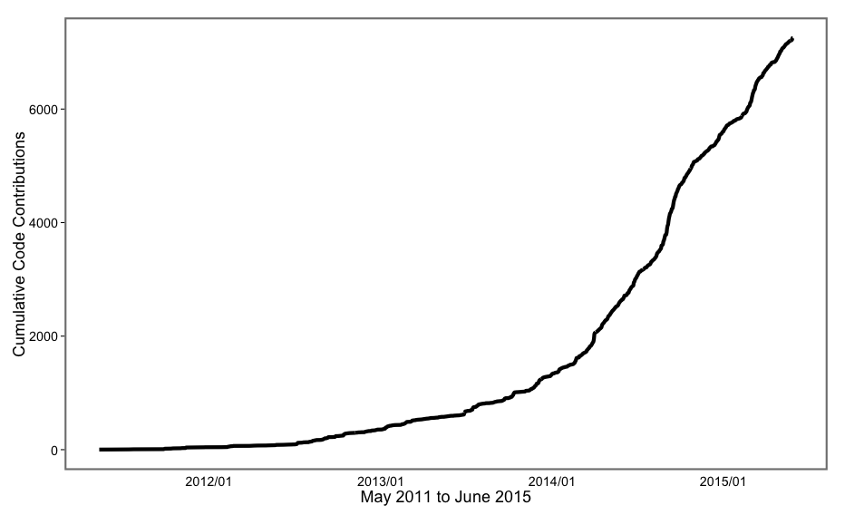
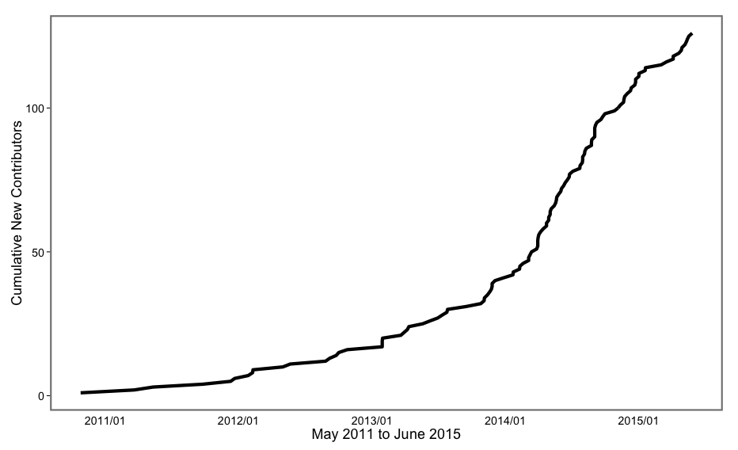

rOpenSci Stats
==============

Scripts to gather and summarise/visualize ropensci stats.

* `cummcommits.R` - visualize cummulative commits through time
* `cummcontribs.R` - visualize cummulative number of contributors through time
* `gathercommits.R` - scripts to gather github commits for ropensci projects
* `github_api_functions.R` - helper functions to interact with the GitHub API

Note about Data: Data in the `data/github_commits.csv` dir works right away with 
`cummcommits.R` and  `cummcontribs.R`. You can update `data/github_commits.csv` using
`gathercommits.R`.

## cummulative commits

## cummulative contributors

