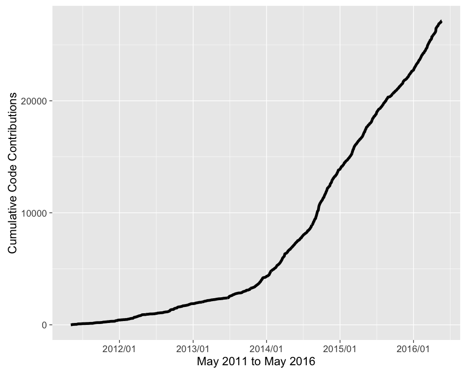
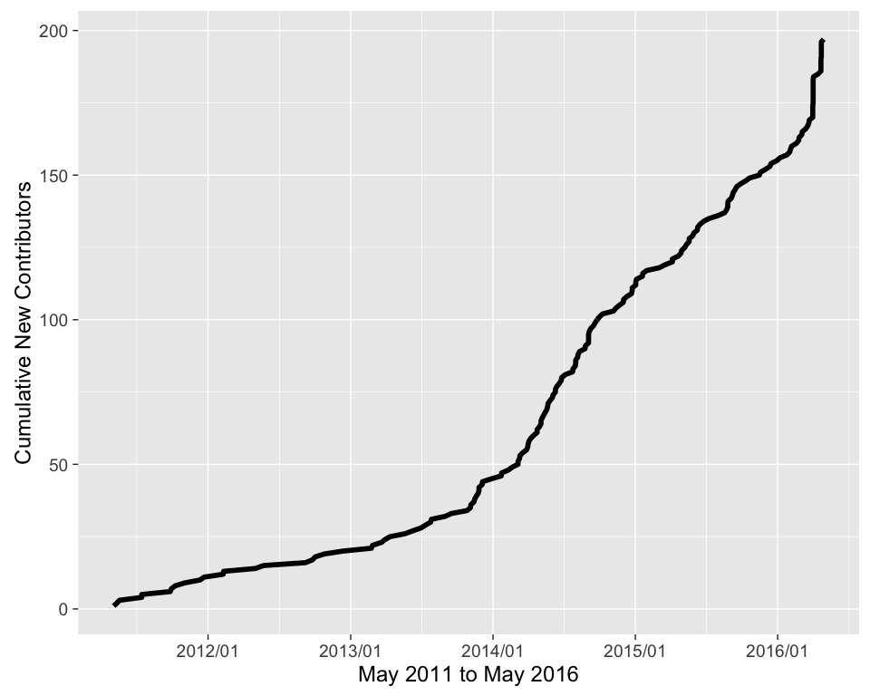

Code contributions
------------------

Git commit history

    cum_commits("github_commits_2016-05-19.csv")

Contributors
------------

Cumulative number of contributors

    cum_contribs("github_commits_2016-05-19.csv")

New packages on CRAN
--------------------

These represent stable/mature enough packages to be delivered to the
world.

    library("dplyr")
    library("ggplot2")

    pkgs <- ropensci_pkgs(TRUE)$name
    res <- gather_crans(pkgs)
    alldat <- bind_rows(res)
    dates <- cran_first_date(alldat)

    # exclude geonames, was created before ropensci existed
    dates <- dates %>% filter(pkg != "geonames")

    # summarise
    dat <- dates %>%
      group_by(date) %>%
      summarise(count = n()) %>%
      mutate(cumsum = cumsum(count))

    ggplot(dat, aes(date, cumsum)) +
      geom_line(size = 2) +
        theme_bw(base_size = 18) +
        theme(panel.grid.major = element_blank(),
              panel.grid.minor = element_blank(),
              legend.position = "none",
              axis.ticks.x = element_blank(),
              panel.border = element_rect(size = 2)) +
      labs(y = 'Cumulative New Packages on CRAN')

Package Downloads
-----------------

Via CRAN downloads stats collected from just one of the CRAN mirrors at
<https://cran.rstudio.com>

    library("ggplot2")
    cum_downloads("cran_downloads_2016-05-20.csv") %+%
      facet_wrap(~package, scales = "free_y", ncol = 2)

